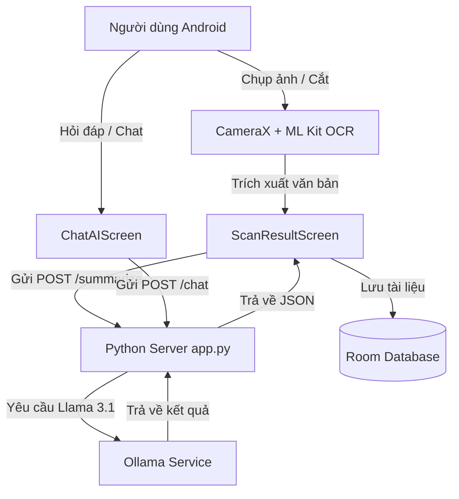

# 🎓 English AI Learning App

> 🚀 **Ứng dụng học tiếng Anh thông minh tích hợp AI (Llama 3.1 / Ollama) & Jetpack Compose dành cho Android**


-FF6F00?style=flat-square&logo=meta)


---

## 📌 Giới thiệu Tổng quan

**English AI Learning App** là giải pháp học tiếng Anh toàn diện trên nền tảng Android, kết hợp giữa giao diện hiện đại Jetpack Compose, xử lý nhận diện hình ảnh On-Device ML Kit và Máy chủ AI cục bộ chạy mô hình **Llama 3.1** (thông qua Ollama).

Ứng dụng giúp học viên giải đáp ngữ pháp, luyện thoại, dịch thuật đa ngôn ngữ, số hóa văn bản từ hình ảnh và ghi nhớ từ vựng thông qua phương pháp thẻ Flashcard 3D sinh động.

---

## ✨ Các Tính năng Chính (Demo v1.0.0)

### 1. 🤖 Trợ lý AI Chat (AI Tutor - Llama 3.1)
- **Tư vấn học tập 24/7**: Hỏi đáp ngữ pháp, giải thích nghĩa từ, sửa lỗi viết câu và luyện tập hội thoại.
- **Quản lý đa phiên trò chuyện**: Tạo và lưu trữ nhiều đoạn chat khác nhau, tự động đặt tên theo câu hỏi đầu tiên.
- **Gợi ý nhanh (Quick Prompts)**: Cung cấp danh sách chủ đề hỏi đáp phổ biến.
- **Tự động phục hồi (Auto Fallback)**: Tự động đưa ra phản hồi hữu ích ngay cả khi chưa bật server AI.

### 2. 📷 Quét tài liệu OCR & Tóm tắt AI (Document Scanner & AI Summary)
- **Chụp & Cắt ảnh thông minh**: Sử dụng CameraX và bộ công cụ cắt ảnh (`canhub-image-cropper`).
- **Trích xuất chữ OCR On-Device**: Nhận diện văn bản tức thì bằng Google ML Kit Text Recognition.
- **Tóm tắt bằng Llama 3.1**: Trích xuất 5 luận điểm chính của văn bản chỉ trong vài giây.
- **Lưu trữ & Tìm kiếm**: Quản lý các file văn bản đã quét trong cơ sở dữ liệu local (Room DB).

### 3. 🌐 Dịch thuật & Phát âm On-Device (Translation & Speech)
- **Google ML Kit Translate**: Dịch thuật Offline 6 ngôn ngữ phổ biến (Việt, Anh, Pháp, Nhật, Đức, Tây Ban Nha).
- **Nhận diện giọng nói (Speech-to-Text)**: Nhập văn bản cần dịch trực tiếp bằng giọng nói.
- **Đọc phát âm (Text-to-Speech)**: Nghe phát âm chuẩn của từ vựng và câu dịch.
- **Lịch sử & Yêu thích**: Lưu trữ bản dịch và đánh dấu câu yêu thích.

### 4. 📚 Thư viện Từ vựng & Thẻ Flashcard 3D
- **Nhập từ vựng tự động**: Tải danh sách từ vựng từ tệp **Excel (.xlsx)** hoặc **CSV**.
- **Quản lý Bộ sưu tập**: Tự tạo danh sách từ vựng theo chủ đề với màu sắc riêng biệt.
- **Luyện thẻ Flashcard 3D**: Lật thẻ 180 độ, nghe phát âm, đánh dấu "Đã thuộc" / "Cần học lại" để theo dõi % tiến độ.

---

## 🛠 Kiến trúc Kỹ thuật & Công nghệ (Tech Stack)

### Android Client (`android-client`)
- **Language**: Kotlin (90%) + Java (Legacy View Adapters)
- **UI Framework**: Jetpack Compose + Material 3, ViewBinding, ConstraintLayout
- **Architecture**: MVVM (Model - View - ViewModel) + Repository Pattern
- **Local Storage**: Room Database (v8) + SQLite
- **Camera & Image**: CameraX, ML Kit Text Recognition, CanHub Image Cropper
- **ML & Voice**: ML Kit Translate, ML Kit Language ID, Android TTS & Speech Recognizer
- **Async & Networking**: Kotlin Coroutines, StateFlow, OkHttp3

### Server AI Backend (`server`)
- **Framework**: Python Flask / HTTP Server
- **AI Core**: Ollama running Meta's **Llama 3.1**
- **Endpoints**:
  - `POST /chat`: Xử lý tư vấn học tiếng Anh.
  - `POST /summarize`: Phân tích tóm tắt văn bản.

---

## 🏗 Sơ đồ Luồng Hệ thống (Data Flow)



---

## 🚀 Hướng dẫn Cài đặt & Trải nghiệm Bản Demo

### 1. Tải bản Demo APK (`app-debug.apk`)
File cài đặt Demo APK đã được biên dịch sẵn tại:
```
android-client/app/build/outputs/apk/debug/app-debug.apk
```
Bạn có thể copy file `app-debug.apk` vào thiết bị Android (Android 8.0+) hoặc Giả lập Android để cài đặt trực tiếp.

### 2. Khởi chạy Máy chủ AI Backend (`server/app.py`)

1. Cài đặt **Ollama** và tải mô hình Llama 3.1:
   ```bash
   ollama pull llama3.1
   ollama run llama3.1
   ```

2. Khởi động Python Server Backend:
   ```bash
   cd server
   pip install -r requirements.txt
   python app.py
   ```
   *Máy chủ sẽ chạy tại địa chỉ `http://0.0.0.0:5000`.*

3. Kết nối Android với Máy chủ AI:
   - Nếu chạy qua cáp USB ADB:
     ```bash
     adb reverse tcp:5000 tcp:5000
     ```
   - Hoặc nhập địa chỉ IP Wi-Fi của máy tính vào nút **Cài đặt Server ⚙️** trên ứng dụng Android.

---

## 📄 Giấy phép (License)

Dự án được phân phối dưới giấy phép **MIT License**.
